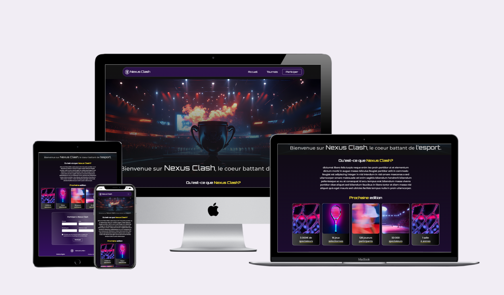

## 🖼️ Preview

  

# Site Web – Intégration Bootstrap

Ce projet est un site web responsive conçu avec **Bootstrap**, basé sur une maquette créée sur **Figma**.  
Les **couleurs graphiques** et **polices thématiques** ont été fournies, et intégrées avec soin dans le design final.

- La mise en page respecte le design validé dans Figma  
- Le site est **responsive**, adapté pour mobile et desktop  
- Intégration d’images, sections claires et structure cohérente

## Fonctionnalités :
- Structure Bootstrap responsive  
- Utilisation des couleurs / polices du client  
- Conversion fidèle de la maquette Figma

## Voir en ligne : https://nbhd12.github.io/Bootstrap-Website/ 
*Un site clair, moderne, conforme à la vision client.*

---

## 🧩 Website – Bootstrap Integration (EN)

This is a **responsive website** built using **Bootstrap**, based on a layout designed in **Figma**.  
The **graphic colors** and **themed fonts** were provided by the client and carefully implemented throughout the site.

- Layout follows the approved Figma design  
- Fully responsive for both mobile and desktop  
- Includes structured content, images, and clean sections

## Features:
- Responsive Bootstrap structure  
- Client-specified colors and fonts  
- Accurate Figma-to-code conversion

## Live Preview: https://nbhd12.github.io/Bootstrap-Website/
*A modern, polished site aligned with client branding.*
